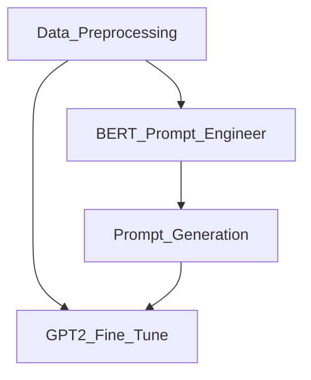

# ds301project
Bringing Dead Philosophers Back To Life: Text Generation with LLMs and Transfer Learning

We first started with Data Preprocessing([Data Preprocessing](DataPreprocessing.ipynb)), to convert raw texts in pdf into tokenized segments. 

There are two options available now: max length(by calling mode='max') and sentence(by calling 'sen').

Preprocessed data are fed into two models: pretrained GPT2, which is our main model to fulfill the generative task, and BERT([BERT'prompt engineer'](BERT'prompt_engineer'.ipynb)), which we use to do Prompt Engineer.

Prompt Engineer is done by first using the topic word of user's input to search relevant texts, embed both the texts and the user's input to find top n similar segments in the texts, prompt into the promt for the fine tuned GPT2, with Prompt Generation([Prompt Generation](PromptGeneration.ipynb)). 
