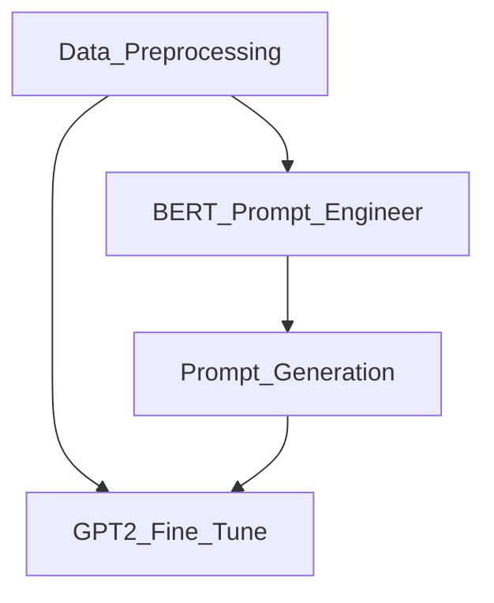

# ds301project
Bringing Dead Philosophers Back To Life: Text Generation with LLMs and Transfer Learning

# Project Background

Our project was to create a philosopher chatbot that can reply to philosophical questions in the style/teachings of a specific philosopher (David Hume). We created this model by primarily implementing the concept of transfer learning and fine tuning. We curated many writings of David Hume, and fine tuned a pretrained GPT-2 model with the data. We also used BERT for a kind of prompt engineering in order to get better outputs from our GPT-2 models. 

# Project Files

We first started with Data Preprocessing([Data Preprocessing](DataPreprocessing.ipynb)), to convert raw texts in pdf into tokenized segments. 

There are two options available now: max length(by calling mode='max') and sentence(by calling 'sen').

Preprocessed data is fed into two models: pretrained GPT2, which is our main model to fulfill the generative task, and BERT([BERT'prompt engineer'](BERT'prompt_engineer'.ipynb)), which we used for do Prompt Engineering.

Prompt Engineering is done by first using the topic word of user's input to search relevant texts, embed both the texts and the user's input to find top n similar segments in the texts, prompt into the prompt for the fine tuned GPT2, with Prompt Generation([Prompt Generation](PromptGeneration.ipynb)). 

# Results
We compared the output from philosophical questions between a base model that had been fed an engineered prompt and a non engineered prompt with our fine tuned GPT model that had been fed an engineered prompt and a non engineered prompt. The results for the question "Is there a continuous self?" can be seen below:

Base model with prompt engineering:

Base model without prompt engineering:

Fine tuned model with prompt engineering:

Fine tuned model without prompt engineering: 

However, we did get some faulty results, such as output from the model that was still encoded. 

