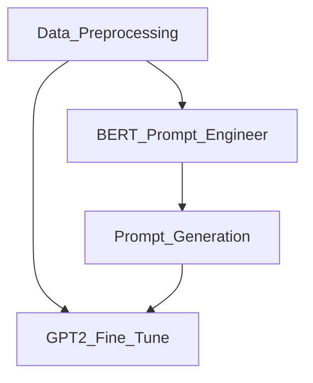

# Bringing Dead Philosophers Back to Life: Text Generation with LLMs and Transfer Learning

# Background

Our project was to create a philosopher chatbot that can reply to philosophical questions in the style/teachings of a specific philosopher (David Hume). We created this model by primarily implementing the concept of transfer learning and fine tuning. We curated many writings of David Hume, and fine tuned a pretrained GPT-2 model with the data. We also used BERT for a kind of prompt engineering in order to get better outputs from our GPT-2 models. 

# Project files and process

In order to replicate our results, the files [All.zip](All.zip) (zip file of Hume's writings), [prompts.txt](prompts.txt) (longer prompts engineered through BERT), and [short_prompts.txt](short_prompts.txt) (short prompts containing just the questions) are needed, along with the code notebooks. The mentioned files were curated manually, while all the other files were generated through running the code contained in the notebooks.

Missing from this repository are the files for the trained model, along with all of the saved checkpoint models; the configuration files for these models were too large to upload to Github.

We first started with preprocessing the training data ([DataPreprocessing.ipynb](DataPreprocessing.ipynb)), to convert raw texts in pdf into tokenized segments. There are two options available now: max length(by calling mode='max') and sentence(by calling 'sen'). Running this notebook creates the [Sentences.txt](Sentences.txt) file, which is used to fine tune the GPT-2 model in [GPT_2_Finetuning.ipynb](GPT_2_Finetuning.ipynb).

The preprocessed data is also used with a BERT model [BERT'prompt_engineer'.ipynb](BERT'prompt_engineer'.ipynb) for prompt engineering. Prompt Engineering is done by first using the topic word of user's input to search relevant texts, embed both the texts and the user's input to find top n similar segments in the texts.

This generated raw text is then turned into prompts to feed into the GPT-2 models with Prompt Generation [PromptGeneration.ipynb](PromptGeneration.ipynb).

We ran the inference section of the [GPT_2_Finetuning.ipynb](GPT_2_Finetuning.ipynb) twice, once with simple prompts, and again with the longer prompts provided through BERT. Each time, we fed the prompts into the fine tuned model, as well as another copy of the base GPT-2 model (the same size before we fine tuned: 'gpt2-large') in order to compare a total of 4 types of outputs (2 types of prompts each for 2 models).

# Results

Our goal for this project was to fine tune a text generation model to imitate how David Hume would write. Compared to the base model, our fine tuned model's responses are definitely more similar to Hume's own writings; the model uses more formal, philosophical language, and also responds with more rhetorical questions (a characteristic of Hume's writings). We also see some success with our efforts at prompt engineering, as the responses to the prompts with prompt engineering are more focused to the topic. Outputs in all 4 scenarious to the question "Is there a continuous self?" can be seen below (the prompt that the model received as an input is in bold):

Base model with prompt engineering:

Base model without prompt engineering:

Fine tuned model with prompt engineering:

Fine tuned model without prompt engineering: 

However, our trained model wasn't perfect: in response to a different prompt, we did get some outputs that failed to decode:

